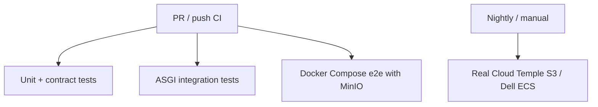

# Tests — MCP Starter Kit

This test suite validates the starter-kit in layers.

## Strategy



## Layers

### 1. CLI / shell contract tests

File:

```text
tests/test_cli_token_rest.py
```

Validates the hybrid architecture:

- MCP `/mcp` is for business/system tools.
- Admin operations use REST `/admin/api/*`.
- Token commands in Click CLI and interactive shell use `/admin/api/tokens`.
- No token admin operation should call a MCP tool named `token`.

### 2. ASGI admin API integration tests

File:

```text
tests/test_admin_api_tokens_asgi.py
```

Calls the real ASGI admin API handler with fake ASGI `scope`, `receive`, and `send`.

Covers:

- `GET /admin/api/health`
- `POST /admin/api/tokens`
- `GET /admin/api/tokens`
- `PUT /admin/api/tokens/{hash_prefix}`
- `DELETE /admin/api/tokens/{hash_prefix}`
- invalid permissions rejection
- invalid bearer rejection

Uses an in-memory fake TokenStore to stay fast and secretless.

### 3. Docker Compose e2e with MinIO

File:

```text
tests/e2e/test_minio_compose.py
```

Compose stack:

```text
boilerplate/docker-compose.ci.yml
```

Validates the concrete flow through WAF + MCP + MinIO-backed S3TokenStore:

1. health through WAF
2. create token via `/admin/api/tokens`
3. token is persisted in S3-compatible MinIO
4. call `/mcp` with created token
5. revoke token via `/admin/api/tokens/{hash_prefix}`
6. revoked token is refused

## Run locally

### Unit + ASGI integration tests

```bash
python -m pytest tests -q -m "not e2e"
```

### Docker Compose e2e

Requires Docker.

```bash
docker compose -f boilerplate/docker-compose.ci.yml up -d --build
RUN_COMPOSE_E2E=1 python -m pytest tests/e2e/test_minio_compose.py -q
docker compose -f boilerplate/docker-compose.ci.yml down -v
```

If the local default `python` is older than 3.10, use Python 3.11:

```bash
RUN_COMPOSE_E2E=1 python3.11 -m pytest tests/e2e/test_minio_compose.py -q
```

## Real S3 tests

MinIO is used for default CI because it is reproducible and secretless.
It does not replace real Cloud Temple / Dell ECS validation.

Real S3 tests should run only in nightly/manual workflows using GitHub environment secrets (for example `nightly-real-s3`).

## Real S3 validation (manual / controlled environment)

The real S3 TokenStore test is available at:

```text
tests/integration/test_real_s3_tokenstore.py
```

It is intentionally **not** wired to GitHub-hosted CI for now.

Reason: the dedicated Cloud Temple S3 test bucket uses a custom access policy with a strict IP whitelist. GitHub-hosted runners use dynamic public IPs and can fail with `AccessDenied` even when credentials and grants are correct.

Default CI therefore remains:

```text
GitHub-hosted CI → MinIO only
```

Real S3 validation should be run either:

- manually from a whitelisted IP, or
- later from a self-hosted GitHub runner with a whitelisted fixed egress IP.

Required environment variables for manual real S3 execution:

```text
RUN_REAL_S3=1
S3_ENDPOINT_URL
S3_ACCESS_KEY_ID
S3_SECRET_ACCESS_KEY
S3_BUCKET_NAME
S3_REGION_NAME
```

Example:

```bash
RUN_REAL_S3=1 python3.11 -m pytest tests/integration/test_real_s3_tokenstore.py -q -m real_s3
```

Credentials must be read from MCP Vault and must never be committed to git.

## Live MCP Vault validation

`VaultTokenStore` is covered by mocked HTTP tests and by a local fake MCP Vault server in default CI.
A live MCP Vault validation is also available for manual/certifying runs:

```text
tests/integration/test_live_vault_tokenstore.py
```

It is intentionally **not** wired to GitHub-hosted CI. It requires a dedicated test path and a limited RW Vault application token. Do not use a production token-store path.

Required environment variables:

```text
RUN_LIVE_VAULT=1
MCP_VAULT_URL=https://vault.mcp.cloud-temple.app
MCP_VAULT_TOKEN
MCP_VAULT_ID
MCP_VAULT_TOKEN_STORE_PATH=token-store/live-vault-validation.json
MCP_VAULT_TIMEOUT=5
```

Example:

```bash
RUN_LIVE_VAULT=1 python3.11 -m pytest tests/integration/test_live_vault_tokenstore.py -q -m live_vault
```

The test starts from an empty dedicated secret, exercises create/list/update/revoke, verifies that raw client tokens are not persisted, and restores the original secret data afterward.

Credentials must be read from MCP Vault or a local secure channel and must never be committed to git.

