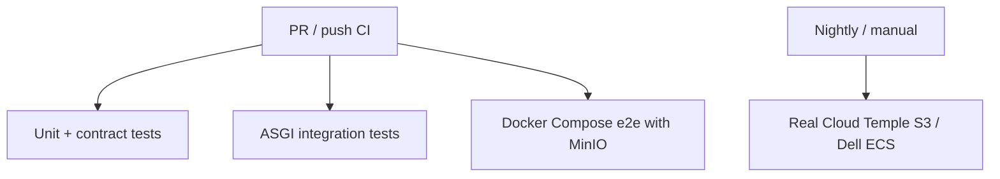

# Tests — MCP Starter Kit

This test suite validates the starter-kit in layers.

## Strategy



## Layers

### 1. CLI / shell contract tests

File:

```text
tests/test_cli_token_rest.py
```

Validates the hybrid architecture:

- MCP `/mcp` is for business/system tools.
- Admin operations use REST `/admin/api/*`.
- Token commands in Click CLI and interactive shell use `/admin/api/tokens`.
- No token admin operation should call a MCP tool named `token`.

### 2. ASGI admin API integration tests

File:

```text
tests/test_admin_api_tokens_asgi.py
```

Calls the real ASGI admin API handler with fake ASGI `scope`, `receive`, and `send`.

Covers:

- `GET /admin/api/health`
- `POST /admin/api/tokens`
- `GET /admin/api/tokens`
- `PUT /admin/api/tokens/{hash_prefix}`
- `DELETE /admin/api/tokens/{hash_prefix}`
- invalid permissions rejection
- invalid bearer rejection

Uses an in-memory fake TokenStore to stay fast and secretless.

### 3. Docker Compose e2e with MinIO

File:

```text
tests/e2e/test_minio_compose.py
```

Compose stack:

```text
boilerplate/docker-compose.ci.yml
```

Validates the concrete flow through WAF + MCP + MinIO-backed S3TokenStore:

1. health through WAF
2. create token via `/admin/api/tokens`
3. token is persisted in S3-compatible MinIO
4. call `/mcp` with created token
5. revoke token via `/admin/api/tokens/{hash_prefix}`
6. revoked token is refused

## Run locally

### Unit + ASGI integration tests

```bash
python -m pytest tests -q -m "not e2e"
```

### Docker Compose e2e

Requires Docker.

```bash
docker compose -f boilerplate/docker-compose.ci.yml up -d --build
RUN_COMPOSE_E2E=1 python -m pytest tests/e2e/test_minio_compose.py -q
docker compose -f boilerplate/docker-compose.ci.yml down -v
```

If the local default `python` is older than 3.10, use Python 3.11:

```bash
RUN_COMPOSE_E2E=1 python3.11 -m pytest tests/e2e/test_minio_compose.py -q
```

## Real S3 tests

MinIO is used for default CI because it is reproducible and secretless.
It does not replace real Cloud Temple / Dell ECS validation.

Real S3 tests should run only in nightly/manual workflows using GitHub environment secrets (for example `nightly-real-s3`).
